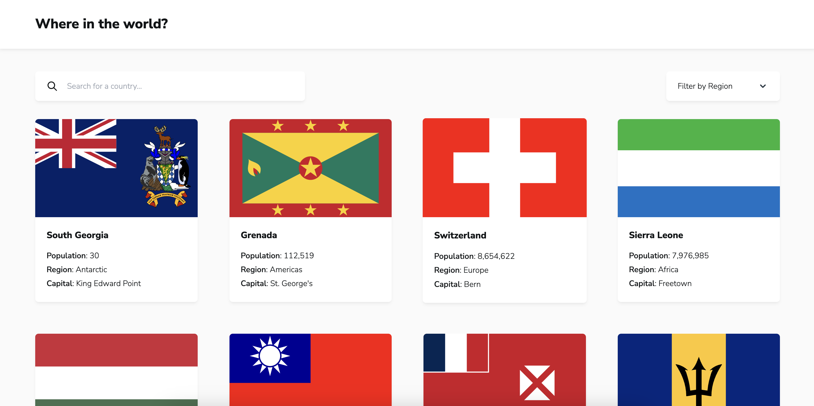
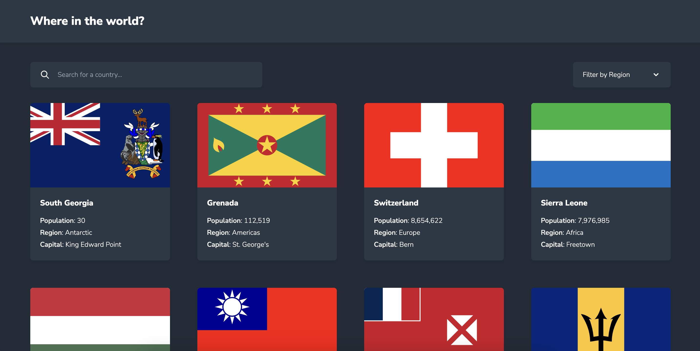

# REST Countries API

This is a solution to the [REST Countries API with color theme switcher challenge on Frontend Mentor](https://www.frontendmentor.io/challenges/rest-countries-api-with-color-theme-switcher-5cacc469fec04111f7b848ca).

## Table of contents

- [Overview](#overview)
  - [The challenge](#the-challenge)
  - [Screenshot](#screenshot)
  - [Links](#links)
  - [Built with](#built-with)

## Overview

### The challenge

Users should be able to:

- See all countries from the API on the homepage
- Search for a country using an `input` field
- Filter countries by region
- Click on a country to see more detailed information on a separate page
- Click through to the border countries on the detail page
- Toggle the color scheme between light and dark mode _(optional)_

### Screenshots

### Links

- Solution URL: https://github.com/ginnymin/projects/tree/main/apps/rest-countries-switcher
- Live Site URL: https://rest-countries-switcher.vercel.app/

### Built with

- Typescript
- Vitest and React Testing Library
- [React](https://reactjs.org/) - JS library
- [Next.js](https://nextjs.org/) - React framework
- [TailwindCSS](https://tailwindcss.com/) - For styles
- [HeadlessUI](https://headlessui.com/) - Headless, accessible React components
- [SWR](https://swr.vercel.app/) - For data fetching and cache
