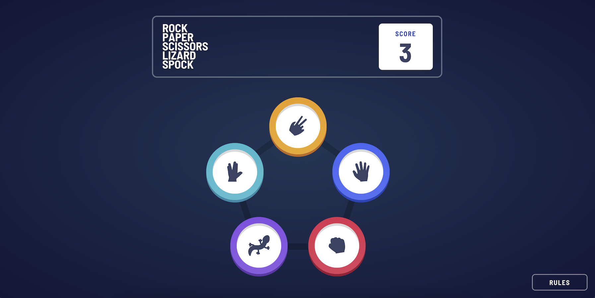

# Rock, Paper, Scissors, Lizard, Spock

This is a solution to the [Rock, Paper, Scissors challenge on Frontend Mentor](https://www.frontendmentor.io/challenges/rock-paper-scissors-game-pTgwgvgH).

## Table of contents

- [Overview](#overview)
  - [The challenge](#the-challenge)
  - [Screenshot](#screenshot)
  - [Links](#links)
  - [Built in and with](#built-in-and-with)

## Overview

### The challenge

Users should be able to:

- View the optimal layout for the game depending on their device's screen size
- Play Rock, Paper, Scissors, Lizard, Spock against the computer
- Maintain the state of the score after refreshing the browser

### Screenshot

### Links

- Solution URL: https://github.com/ginnymin/projects/tree/main/apps/rock-paper-scissors
- Live Site URL: https://projects-rock-paper-scissors.vercel.app

### Built in and with:

- Typescript
- Vitest and React Testing Library
- [React](https://reactjs.org/) - JS library
- [Next.js](https://nextjs.org/) - React framework
- [TailwindCSS](https://tailwindcss.com/) - For styles
- [HeadlessUI](https://headlessui.com/) - Headless, accessible React components

## Scripts

In the `rock-paper-scissors` project directory, you can run:

### `yarn dev`

Run a dev version of the application at `http://localhost:3000`.

### `yarn lint`

Performs type checking with Typescript and code quality checks with ESLint.

### `yarn test`

Runs unit tests.

### `yarn build`

Builds a production version of the application.
